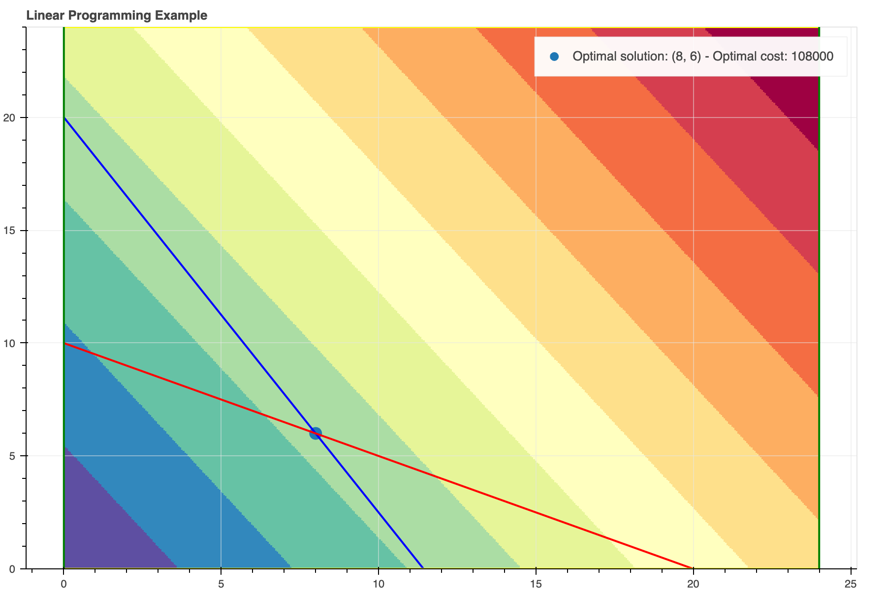
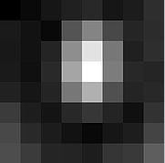
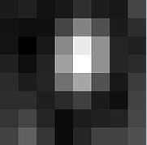

# Introduzione
La presente dispensa ha l'obiettivo di mettere a disposizione di chi vuole un selezionato numero di argomenti alla base del sapere matematico.

In questa parte introduttiva cercheremo di dare risposte sintetiche ad alcuni quesiti, il primo dei quali è:

!!! quote ""
    Cos'è la matematica?

Matematica deriva dal greco μάθημα (máthema), ossia conoscenza, ed è in pratica la scienza che si occupa della ricerca della verità, e nient'altro che questo.
Si comincia a pensare matematicamente non appena si instilla in noi il dubbio se questo o quello sia vero o falso.

Il secondo quesito che legittimamente uno si chiede è:

!!! quote ""
    A cosa serve la matematica?

Le persone che si pongono questo quesito sono solitamente interessate agli sbocchi professionali/economici che questa disciplina comporta. Ragion per cui non vengono soddisfatte da una risposta del tipo "La matematica serve a cercare la verità". Occorre dare allora alcuni esempi che possano convincerli che "Sì, la matematica può servire". Nel prosieguo, ne vedremo alcuni.

## Esempi pratici
Di seguito alcuni esempi pratici di utilizzo della matematica al fine di:

- Consentire la trasmissione sicura di dati attraverso algoritmi di crittografia.
- Effettuare scelte ottimali in problemi decisionali.
- Comprimere immagini preservandone la qualità.

### Crittografia asimmetrica
La crittografia asimmetrica è un tipo di crittografia dove, come si evince dal nome, ad ogni attore coinvolto nella comunicazione è associata una coppia di chiavi:

- La chiave pubblica, che deve essere distribuita.
- La chiave privata, appunto personale e segreta.

Il meccanismo si basa sui punti seguenti:

- Se con una delle due chiavi si cifra un messaggio, allora quest'ultimo sarà decifrato solo con l'altra.
- Nonostante le due chiavi siano fra loro dipendenti, non è possibile risalire dall'una all'altra.

L'idea base della crittografia con coppia di chiavi diviene più chiara se si usa un'analogia postale, in cui il mittente è Alice ed il destinatario Bob, i lucchetti fanno le veci delle chiavi pubbliche e le chiavi recitano la parte delle chiavi private:

- Alice chiede a Bob di spedirle il suo lucchetto, già aperto. La chiave dello stesso verrà però gelosamente conservata da Bob.
- Alice riceve il lucchetto e, con esso, chiude il pacco e lo spedisce a Bob.
- Bob riceve il pacco e può aprirlo con la chiave di cui è l'unico proprietario.

Se adesso Bob volesse mandare un altro pacco ad Alice, dovrebbe farlo chiudendolo con il lucchetto di Alice (che lei dovrebbe aver preventivamente dato a Bob) che solo lei potrebbe aprire.

Passiamo ora ad illustrare un algoritmo di crittografia asimmetrica noto come RSA. Esso è basato sull'elevata complessità computazionale della fattorizzazione in numeri primi. Il suo funzionamento è il seguente:

1. Si scelgono a caso due numeri primi, $p$ e $q$ abbastanza grandi da garantire la sicurezza dell'algoritmo. [es. $p=53$, $q=59$]
2. Si calcola il loro prodotto $n=pq$, chiamato modulo (dato che tutta l'aritmetica seguente è modulo $n$), e il prodotto $\varphi(n)=(p-1)(q-1)$. [es. $n=3127$, $\varphi(n)=3016$]
3. Si sceglie poi un numero $e$ (chiamato esponente pubblico), coprimo con $n$ e più piccolo di $\varphi(n)$. [es. $e=3$]
4. Si calcola il numero $d$ (chiamato esponente privato) tale che il suo prodotto con $e$ sia congruo a $1$ modulo $\varphi(n)$ ovvero che $ed \equiv 1 \pmod{\varphi(n)}$. [es. $d = 2011$]

La chiave pubblica è $(n,e)$, mentre la chiave privata è $(n,d)$.

La forza dell'algoritmo sta nel fatto che per calcolare $d$ da $e$ (o viceversa) non basta la conoscenza di $n$ ma serve il numero $\varphi(n)=(p-1)(q-1)$, e che il suo calcolo richiede tempi molto elevati; infatti fattorizzare in numeri primi (cioè scomporre un numero nei suoi divisori primi) è un'operazione computazionalmente costosa.

Un messaggio $m$ viene cifrato attraverso la funzione $c(m) = m^{e} \pmod{n}$. Una volta trasmesso, $c(m)$ viene decifrato con $c(m)^{d} \pmod{n} = m$.

Ad esempio, volendo cifrare e poi decifrare il messaggio $\text{hi}$ utilizzando le chiavi viste in precedenza, procederemo come segue:

1. Convertiamo lettere in numeri: $\text{h} = 8$, $\text{i} = 9$.
2. Il messaggio da cifrare viene trasformato in $m = 89$.
3. Cifriamo $m$ ottenendo $c(m) = 89^{e} \pmod{n}$, ossia $c(m) = 1394$.
4. Decifriamo $c(m)$ ottenendo $m = c(m)^{d} \pmod{n}$, ossia $m = 89$, come previsto.

!!! danger "Attenzione"
    Per garantire una elevata complessità computazionale e, quindi, una elevata sicurezza, occorre che i numeri primi scelti $p$ e $q$ siano molto più elevati di quelli utilizzati in questo esempio.

### Programmazione lineare
La programmazione lineare è un metodo per ottenere il miglior risultato (come il massimo profitto o il minor costo) in un modello matematico i cui requisiti sono rappresentati da relazioni lineari. La programmazione lineare è un caso speciale di programmazione matematica (nota anche come ottimizzazione matematica).

Più formalmente, la programmazione lineare è una tecnica per l'ottimizzazione di una funzione obiettivo lineare, soggetta a vincoli di lineari di uguaglianza e disuguaglianza. La sua regione ammissibile è un politopo convesso, che è un insieme definito come l'intersezione di un numero finito di semispazi, ciascuno dei quali descritto da una disuguaglianza lineare. La sua funzione obiettivo è una funzione affine (lineare) a valori reali definita su questo politopo. Un algoritmo di programmazione lineare trova (se esiste) un punto nel politopo in cui questa funzione ha il valore massimo (o minimo).

Problemi di programmazione lineare possono esprimersi in forma canonica come:

$$
\begin{aligned}&
     {\text{maximize}}&&\mathbf{c}^{T}\mathbf{x} \\
     &{\text{subject to}}&&A\mathbf{x}\leq\mathbf{b} \\
     & &&\mathbf{x}\geq\mathbf{0}.
\end{aligned}
$$

dove $x\in\mathbb{R}^n$ è la variabile incognita decisionale, mentre $c\in\mathbb{R}^n$, $A\in\mathbb{R}^{m\times n}$ e $b\in\mathbb{R}^{m}$ sono parametri noti del problema.

La programmazione lineare può essere applicata a vari campi di studio. È ampiamente utilizzato in matematica così come in economia e in ingegneria. I settori che utilizzano modelli di programmazione lineare includono trasporti, energia, telecomunicazioni e produzione.

Diamo un esempio di tale problema. Fiat sta progettando la nuova "Topolino", in due diverse versioni:

- Hybrid
- Full Electric

I Business Analyst di Fiat prevedono una domanda di 80 vetture "Topolino Hybrid" e 20 "Topolino Full Electric" al giorno durante il primo anno. Tenendo conto del costo di produzione e della capacità di ciascun impianto industriale:

|Site ID|Site|Hourly Capacity|Hourly Cost|
|-------|----|----------|----------------|
|0|Torino|7 Hybrid, 1 Full Electric|9000|
|1|Buenos Aires|4 Hybrid, 2 Full Electric|6000|

determinare la decisione ottimale per raggiungere i requisiti di produzione con il minimo costo.

Vale la pena notare che il problema di cui sopra può essere scritto come segue:

$$
\begin{aligned}&
     {\text{minimize}}&& 9000 x_0 + 6000 x_1 \\
     &{\text{subject to}}&& 80 \leq 7 x_0 + 4 x_1  \\
     & && 20 \leq x_0 + 2 x_1 \\
     & && 0 \leq x_0 \leq 24 \\
     & && 0 \leq x_1 \leq 24 \\
\end{aligned}
$$

dove le variabili decisionali sono:

- $x_0$: numero di ore lavorative giornaliere a Torino
- $x_1$: numero di ore lavorative giornaliere a Buenos Aires

Il suddetto problema può risolversi tramite l'algoritmo del simplesso. Il grafico del problema è riportato nella figura seguente, dove:

- La scala cromatica esprime il valore assunto dalla funzione obiettivo $f(x) = 9000 x_0 + 6000 x_1$ nei vari punti dello spazio, le tonalità blu indicano valori bassi, quelle rosse valori elevati.
- La linea rossa è relativa al vincolo $80 \leq 7 x_0 + 4 x_1$.
- La linea blu è relativa al vincolo $20 \leq x_0 + 2 x_1$.
- Le linee verdi sono relative ai vincoli $0 \leq x_0 \leq 24$.
- Le linee gialle sono relative ai vincoli $0 \leq x_1 \leq 24$.
- La decisionale ottimale coincide con l'intersezione delle linee rossa e blu, ed è $(\hat{x}_0, \hat{x}_1) = (8, 6)$ e il relativo costo ottimale è $f(\hat{x}_0, \hat{x}_1) = 108000$.

### Compressione di immagini
Capita spesso di dovere ottimizzare lo spazio di memoria dei dispositivi per consentirne una maggiore capacità. In tal caso, gli algoritmi di compressione delle immagini possono venire in nostro aiuto. Tra questi, uno dei più famosi è l'algoritmo JPEG. Cerchiamo di spiegare come funzione attraverso un esempio. Consideriamo la seguente immagine elementare (un blocco composto da $8 \times 8$ pixel):

Tale immagine viene espressa matematicamente dalla matrice $8 \times 8$:

$$
g = \left[{\begin{array}{rrrrrrrr}52&55&61&66&70&61&64&73\\63&59&55&90&109&85&69&72\\62&59&68&113&144&104&66&73\\63&58&71&122&154&106&70&69\\67&61&68&104&126&88&68&70\\79&65&60&70&77&68&58&75\\85&71&64&59&55&61&65&83\\87&79&69&68&65&76&78&94\end{array}}\right]
$$

L'obiettivo è quello di ridurre la dimensionalità di tale immagine. Per far ciò si utilizza uno strumento matematico noto come _Trasformata discreta del coseno_, indicata anche on DCT, la cui formula è la seguente:

$$
\ G_{u,v}={\frac {1}{4}}\alpha (u)\alpha (v)\sum _{x=0}^{7}\sum _{y=0}^{7}g_{x,y}\cos \left[{\frac {(2x+1)u\pi }{16}}\right]\cos \left[{\frac {(2y+1)v\pi }{16}}\right]
$$

dove:

- $u$ è la frequenza spaziale orizzontale, con $0\leq u\leq 8$.
- $v$ è la frequenza spaziale verticale, con $0\leq v\leq 8$.
- $\alpha (u)={\begin{cases}{\frac {1}{\sqrt {2}}},&{\mbox{if }}u=0\\1,&{\mbox{otherwise}}\end{cases}}$ è un fattore normalizzante.
- $g_{x,y}$ is the pixel value at coordinates $(x,y)$.
- $G_{u,v}$ is the DCT coefficient at coordinates $(u,v)$.

Tale DCT viene utilizzata per estrarre i valori energetici corrispondenti a ciascuna frequenza. Se eseguiamo questa trasformazione sulla nostra matrice sopra, otteniamo quanto segue:

$$G={\begin{array}{c}u\\\longrightarrow \\\left[{\begin{array}{rrrrrrrr}-415.38&-30.19&-61.20&27.24&56.12&-20.10&-2.39&0.46\\4.47&-21.86&-60.76&10.25&13.15&-7.09&-8.54&4.88\\-46.83&7.37&77.13&-24.56&-28.91&9.93&5.42&-5.65\\-48.53&12.07&34.10&-14.76&-10.24&6.30&1.83&1.95\\12.12&-6.55&-13.20&-3.95&-1.87&1.75&-2.79&3.14\\-7.73&2.91&2.38&-5.94&-2.38&0.94&4.30&1.85\\-1.03&0.18&0.42&-2.42&-0.88&-3.02&4.12&-0.66\\-0.17&0.14&-1.07&-4.19&-1.17&-0.10&0.50&1.68\end{array}}\right]\end{array}}{\Bigg \downarrow }v.$$

Si noti come la maggior parte dell'energia sia contenuta nelle frequenze più basse (ossia all'angolo in alto a sinistra). Questo aspetto è importante e ci dice in pratica che l'occhio umano distingue meglio le basse frequenze, mentre le alte frequenza rilasciano una informazione trascurabile.

A questo punto, per mettere meglio in risalto questo aspetto, si procede a una quantizzazione dell'immagine. In pratica, presa la matrice di quantizzazione:

$$
Q={\begin{bmatrix}16&11&10&16&24&40&51&61\\12&12&14&19&26&58&60&55\\14&13&16&24&40&57&69&56\\14&17&22&29&51&87&80&62\\18&22&37&56&68&109&103&77\\24&35&55&64&81&104&113&92\\49&64&78&87&103&121&120&101\\72&92&95&98&112&100&103&99\end{bmatrix}}
$$

la DCT quantizzata si definisce come:

$$
B_{j,k}=\mathrm {round} \left({\frac {G_{j,k}}{Q_{j,k}}}\right){\mbox{ for }}j=0,1,2,\ldots ,7;k=0,1,2,\ldots,7
$$

In questo esempio specifico si ottiene:

$$
B=\left[{\begin{array}{rrrrrrrr}-26&-3&-6&2&2&-1&0&0\\0&-2&-4&1&1&0&0&0\\-3&1&5&-1&-1&0&0&0\\-3&1&2&-1&0&0&0&0\\1&0&0&0&0&0&0&0\\0&0&0&0&0&0&0&0\\0&0&0&0&0&0&0&0\\0&0&0&0&0&0&0&0\end{array}}\right].
$$

Si noti come l'operazione di quantizzazione abbia effettivamente ridotto il numero di coefficienti non nulli della matrice. Questi e solo questi verranno infine memorizzati costituendo l'immagine compressa in formato JPEG.

L'operazione di decodifica segue il processo inverso e porterà alla visualizzazione dell'immagine JPEG seguente:

Che è molto simile a quella originale.